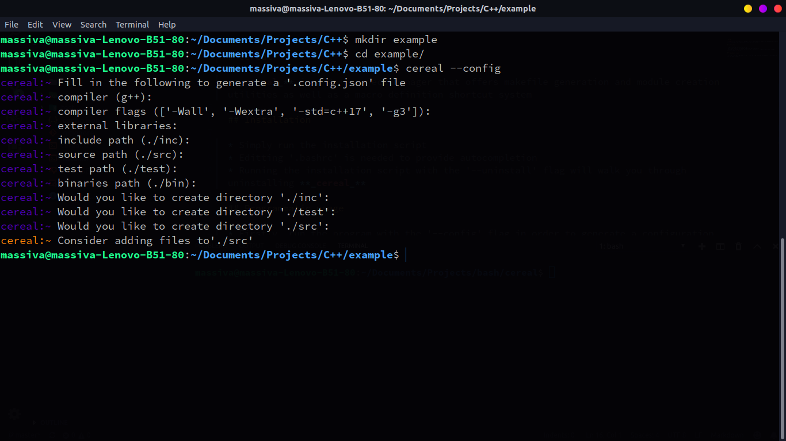
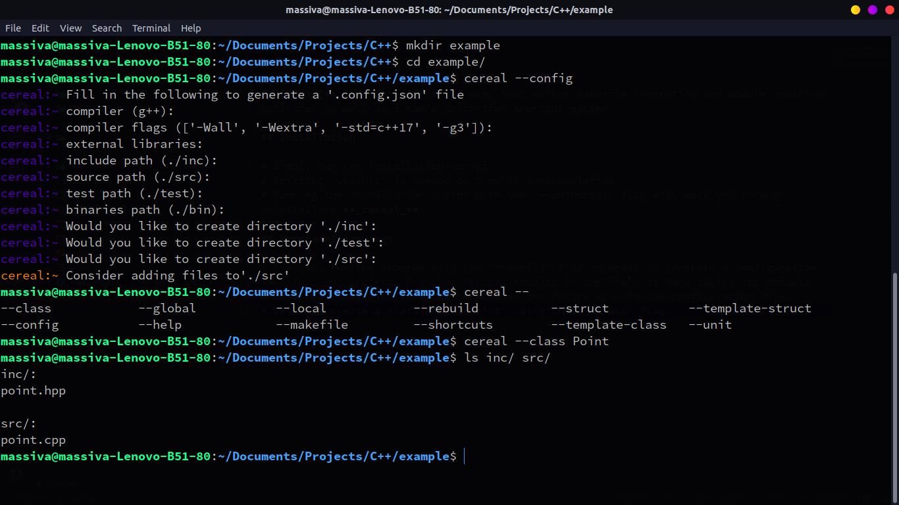
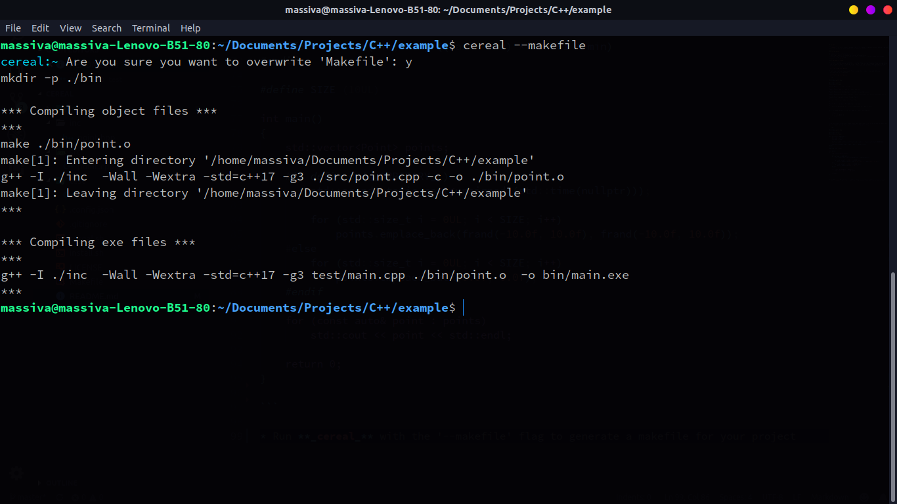
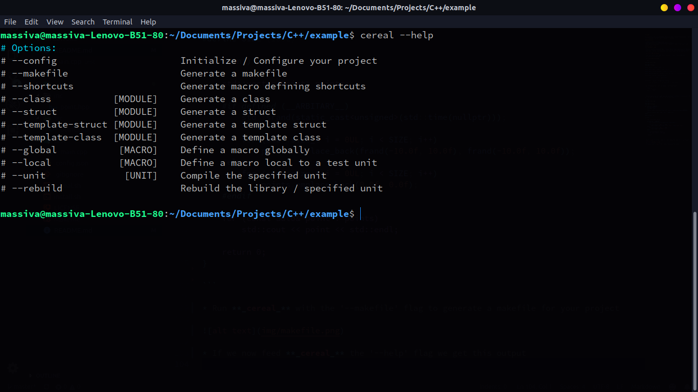
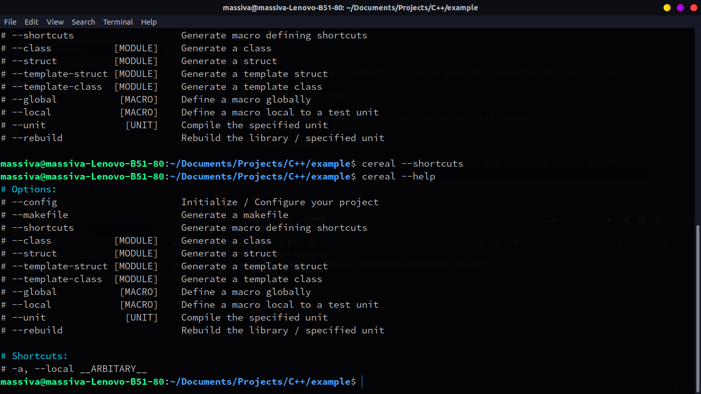
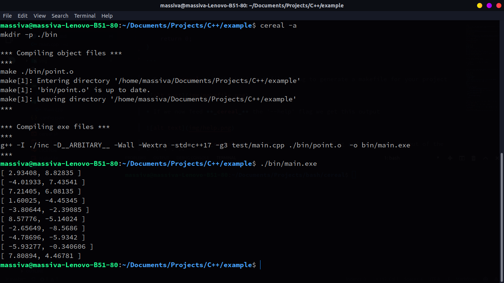
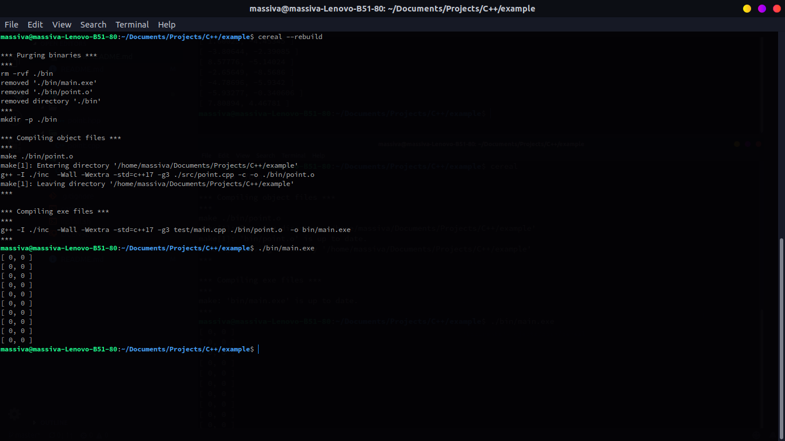
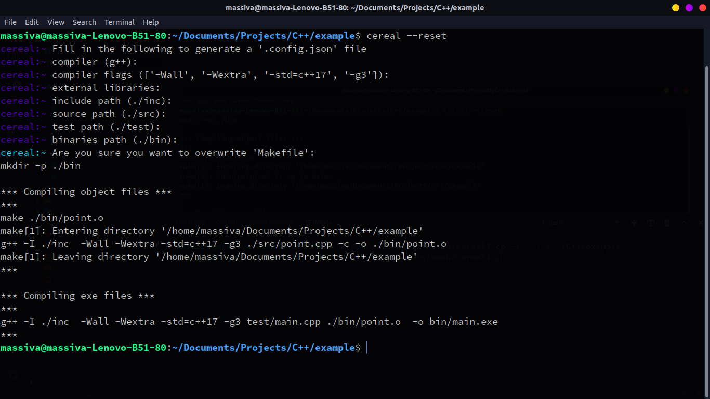

**_cereal_** is a C++ project manager, that offers makefile and module generation utilities as well as a macro definition shortcut system

## Dependecies
* [python3](https://www.python.org/download/releases/3.0/)

## Installation

* Simply run the installation script
* Editing '.bashrc' is required to provide autocompletion
* Running the installation script with the **--uninstall** option, will walk you through uninstalling **_cereal_**

## Programmatic usage

* Firstly, let's run **_cereal_** with the **--config** option, so that a configuration file is generated for our project
* An input consisting only of whitespace characters results in the field at hand taking its default value
* The **--config** option can be used in the future to edit the configuration file
* Bare in mind that generating a new makefile is required for all changes to take effect, in case you alter your configuration file



* Let's now create a class named 'Point' using the **--class** option



```cpp

#include <point.hpp>

Point::Point()
{

}

Point::Point(const Point& other)
{

}

Point::Point(Point&& other) noexcept
{

}

Point::~Point()
{

}

Point& Point::operator=(const Point& other)
{

}

Point& Point::operator=(Point&& other) noexcept
{

}

```

* Let's add some funtionality to its methods

```cpp

#include <point.hpp>

#include <utility>
#include <fstream>

Point::Point() : x(0.0f), y(0.0f)
{
}

Point::Point(float x, float y) : x(x), y(y)
{
}

Point::Point(const Point& other) : x(other.x), y(other.y)
{
}

Point::Point(Point&& other) noexcept : x(std::move(other.x)), y(std::move(other.y))
{
}

Point& Point::operator=(const Point& other)
{
    x = other.x; y = other.y; return *this;
}

Point& Point::operator=(Point&& other) noexcept
{
    x = std::move(other.x); y = std::move(other.y); return *this;
}

std::ostream& operator<<(std::ostream& os, const Point& point)
{
    return os
    << "[ " << point.x
    << ", " << point.y
    << " ]";
}

```

* Let's finally create a test unit and place it in the directory we designated as 'test-path' during the configuration stage

```cpp

#include <point.hpp>

#include <vector>
#include <iostream>

#if defined (__ARBITARY__)
    #include <cstdlib>
    #include <ctime>

    #define rand01 (static_cast<float>(std::rand()) / static_cast<float>(RAND_MAX))
    
    #define frand(min, max) ((max - min) * rand01 + min)
#endif

#define SIZE (10UL)

int main()
{
    std::vector<Point> points;

    #if defined (__ARBITARY__)
        std::srand(static_cast<unsigned>(std::time(nullptr)));

        for (std::size_t i = 0UL; i < SIZE; i++)
            points.emplace_back(frand(-10.0f, 10.0f), frand(-10.0f, 10.0f));
    #else
        for (std::size_t i = 0UL; i < SIZE; i++)
            points.emplace_back(0.0f, 0.0f);
    #endif

    for (const auto& point : points)
        std::cout << point << std::endl;

    return 0;
}

```

* Let's now run **_cereal_** with the **--makefile** option to generate a makefile for our project



* Running **_cereal_** with the **--help** option results in the following output



* Let's now run **_cereal_** with the **--shortcuts** option and check if anything has changed



* As you can see, **_cereal_** has detected the macro **\_\_ARBITARY\_\_** and created a shortcut for defining it
* I should mention at this point that **_cereal_** does not bother itself with the macro **SIZE**, as it does not take part in any conditional preprocessing block and thus it is considered a _statement_ rather than an _option_

* The output of the final executable when compiled with and without the '-a' shortcut





* The shortcut system works by expanding a _shortcut_ into its corresponding _value_, so you can easily create new shortcuts whose role is not defining a macro. For example:

```json
{
    "compiler": "g++",
    "compiler-flags": [
        "-Wall",
        "-Wextra",
        "-std=c++17",
        "-g3"
    ],
    "external-libraries": [],
    "include-path": "./inc",
    "source-path": "./src",
    "test-path": "./test",
    "binaries-path": "./bin",
    "shortcuts": {
        "-a": "--local __ARBITARY__",
        "--reset": "--config --makefile"
    }
}
```


